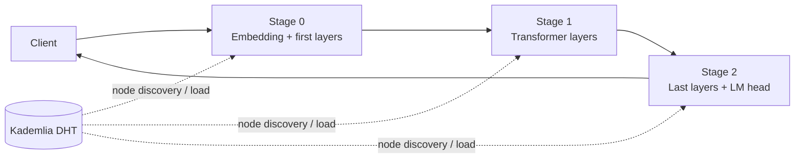

# InferD

Experimental framework for **distributed LLM inference** across multiple nodes.

InferD was developed as a project practicum to explore how a transformer can be split into pipeline stages and executed across several machines. The current prototype partitions a Qwen2 model, discovers nodes through a Kademlia-based DHT, routes intermediate activations between stages, and contains an experimental load-balancing mechanism.

## What it does

A language model is split into several sequential stages. Each node stores one stage and exposes an HTTP endpoint for the forward pass. During inference, the request moves through the pipeline until the final stage produces the next token.



The stage layout is configured in `petals/inferd.yaml`. The default configuration uses `Qwen/Qwen2-0.5B` and splits its transformer layers between several nodes.

## Main components

- **Model partitioning** — `split_model.py` separates the Hugging Face Qwen2 model into first, intermediate, and final pipeline stages.
- **Distributed nodes** — each node runs an `aiohttp` service and executes the model fragment assigned to its stage.
- **Node discovery** — nodes publish their state through a Kademlia-based distributed hash table.
- **Load-aware routing** — when several nodes can execute the same stage, the current implementation selects the node with the lowest reported load.
- **Experimental rebalancing** — nodes periodically report their load and can change stages when the pipeline becomes imbalanced.
- **Docker deployment** — `generate_docker_compose.py` builds a Compose configuration from the model-stage configuration.
- **Dashboard** — a small terminal dashboard displays nodes, stages, addresses, and the number of tasks currently in progress.

## Repository structure

```text
InferD/
├── petals/                     # distributed inference logic
│   ├── node.py                 # HTTP node and request forwarding
│   ├── kademlia_client.py      # DHT integration
│   ├── path_finder.py          # stage/node selection
│   ├── balance.py              # experimental load balancing
│   ├── partitioned_models.py   # partitioned Qwen2 execution
│   ├── task_scheduler.py       # per-node task accounting
│   ├── send_message.py         # simple inference client
│   └── inferd.yaml             # model and stage configuration
├── dashboard/                  # terminal monitoring prototype
├── split_model.py              # splits the model into stage artifacts
├── generate_docker_compose.py  # generates multi-node deployment
├── Dockerfile
└── run.sh                      # local end-to-end demo
```

## Quick start

### Requirements

- Python 3.11+
- [uv](https://docs.astral.sh/uv/)
- Docker with Docker Compose
- enough disk/RAM to download and split the configured Hugging Face model

### Run the local demo

```bash
git clone https://github.com/sellerbto/InferD.git
cd InferD
uv sync
bash run.sh
```

`run.sh` performs the following steps:

1. downloads and splits the configured model into pipeline stages;
2. generates `docker-compose.generated.yml`;
3. starts one container per configured node;
4. sends test generation requests through the distributed pipeline.

To change the model or layer-to-stage mapping, edit `petals/inferd.yaml` before running the script.

## Example node state

The monitoring code represents each stage as a set of available nodes together with their current load:

```text
+--------------+----------------+---------------+
| Stage number | Address        | Tasks in work |
+--------------+----------------+---------------+
| 1            | 127.0.0.1:8080 | 2             |
| 1            | 127.0.0.2:8080 | 1             |
| 2            | 127.0.0.1:8080 | 3             |
| 3            | 127.0.0.3:8080 | 0             |
+--------------+----------------+---------------+
```

## Project practicum

The project was built as a practicum focused on distributed inference and systems experimentation. The main work included:

- splitting a transformer into independently executable stages;
- transferring intermediate activations between nodes;
- implementing node discovery and stage registration through a DHT;
- routing requests through an N-node pipeline;
- experimenting with load-aware stage selection and rebalancing;
- packaging the prototype into a reproducible Docker-based local deployment.

The architecture was inspired by ideas from distributed inference systems such as **Petals** and **SWARM**, while the implementation here is an independent educational prototype.

## Status

InferD is a **research/educational prototype**, not a production inference server. The current code is primarily intended for experiments with pipeline partitioning, routing, discovery, and load balancing. Fault tolerance, dynamic reassignment, scheduling, and path selection are still experimental and have room for further work.
